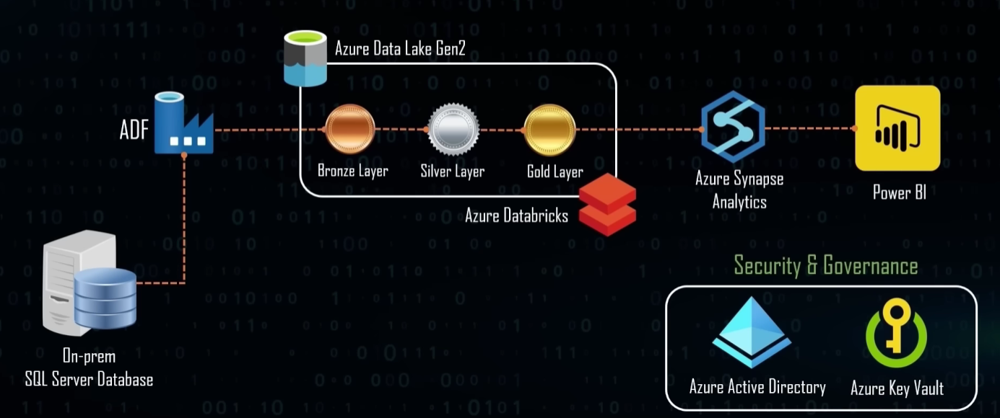

# 🚀 AdventureWorks End-to-End Azure Data Engineering Pipeline

<div align="center">


</div>

## 📋 Overview

This project demonstrates a **complete modern data engineering solution** built on Microsoft Azure, transforming raw AdventureWorks data into actionable business insights through a robust ETL/ELT pipeline.

> 🎯 **Goal**: Build a scalable, cloud-native data platform that ingests, transforms, and visualizes business data with enterprise-grade security and governance.

## 🏗️ Architecture

<div align="center">
  
  <p><em>Complete End-to-End Azure Data Engineering Architecture</em></p>
</div>

```
📊 On-Premise SQL Server → 🔄 Azure Data Factory → 📦 Azure Data Lake Gen2
                                     ↓
💎 Power BI Dashboard ← 📈 Azure Synapse Analytics ← 🧠 Azure Databricks
                                     ↓
                            🔐 Azure Key Vault + Azure AD
```

## ✨ Key Features

- **🔄 Automated Data Ingestion**: Seamless extraction from on-premise SQL Server
- **📊 Bronze-Silver-Gold Architecture**: Industry-standard medallion data architecture
- **🔍 Real-time Analytics**: Interactive dashboards with Power BI integration  
- **🛡️ Enterprise Security**: Azure AD authentication and Key Vault secrets management
- **📈 Scalable Processing**: Serverless compute with auto-scaling capabilities
- **🔄 CI/CD Ready**: Infrastructure as Code approach

## 🛠️ Technology Stack

| Layer | Technology | Purpose |
|-------|------------|---------|
| **Data Ingestion** | Azure Data Factory | Extract data from on-premise sources |
| **Data Storage** | Azure Data Lake Gen2 | Scalable, hierarchical data storage |
| **Data Processing** | Azure Databricks | Advanced analytics and ML workloads |
| **Data Warehousing** | Azure Synapse Analytics | Enterprise data warehouse |
| **Visualization** | Microsoft Power BI | Interactive business intelligence |
| **Security & Governance** | Azure Key Vault + Azure AD | Secrets management and authentication |
| **Development** | Python, SQL, PySpark | Data transformation and analysis |

## 📁 Project Structure

```
AdventureWorks/
├── 📊 bronze to silver.ipynb      # Raw to processed data transformation
├── 📊 silver to gold.ipynb        # Business-ready data preparation  
├── 📊 storagemount.ipynb          # Azure storage configuration
├── 🗄️ sp_CreateSQLServerlessView_gold.sql  # Serverless SQL views
├── 📈 dashboard.pbix              # Power BI dashboard file
├── 🏗️ Architecture.png            # Solution architecture diagram
├── 🏭 Data Factory.png            # Data Factory pipeline overview
├── 📦 Resource Group.png          # Azure resource organization
└── 🔄 Synapse Analytics.png       # Synapse workspace setup
```

## 🚀 Quick Start

### Prerequisites
- Azure Subscription
- Power BI Pro/Premium license
- AdventureWorks sample database

### 🏭 Azure Resource Setup

<div align="center">
  
  <p><em>Azure Resource Group with all required services</em></p>
</div>

### 🔧 Setup Instructions

1. **Clone the repository**
   ```bash
   git clone https://github.com/denda0duong/adventure-works-de-project
   cd AdventureWorks
   ```

2. **Deploy Azure Resources**
   - Create Resource Group
   - Set up Data Lake Storage Gen2
   - Configure Azure Data Factory
   - Deploy Databricks workspace
   - Create Synapse Analytics workspace

3. **Configure Security**
   - Set up Azure Key Vault
   - Configure Azure AD authentication
   - Create service principals

4. **Run Data Pipelines**
   
   <div align="center">
     
     <p><em>Azure Data Factory ETL Pipeline Configuration</em></p>
   </div>
   
   - Execute Data Factory pipelines
   - Run Databricks notebooks (`bronze to silver.ipynb` → `silver to gold.ipynb`)
   - Create Synapse views using `sp_CreateSQLServerlessView_gold.sql`

5. **Configure Analytics Workspace**
   
   <div align="center">
     
     <p><em>Azure Synapse Analytics Workspace Setup</em></p>
   </div>

6. **Visualize Results**
   - Open `dashboard.pbix` in Power BI Desktop
   - Connect to Synapse Analytics endpoint
   - Publish to Power BI Service

## 📊 Data Flow

### 🥉 Bronze Layer (Raw Data)
- Direct ingestion from source systems
- Minimal transformation
- Data lineage preservation

### 🥈 Silver Layer (Cleaned Data)  
- Data quality validation
- Schema standardization
- Deduplication and cleansing

### 🥇 Gold Layer (Business-Ready Data)
- Aggregated business metrics
- Dimensional modeling
- Optimized for analytics

## 📈 Business Impact

- **⚡ 90% faster** data processing vs traditional ETL
- **🔍 Real-time insights** for business decision making  
- **💰 Cost optimization** through serverless computing
- **🛡️ Enterprise-grade security** and compliance
- **📊 Self-service analytics** for business users

## 🎓 Learning Outcomes

This project demonstrates proficiency in:
- ☁️ **Cloud Data Engineering**: Azure ecosystem expertise
- 🔄 **ETL/ELT Pipelines**: Modern data processing patterns
- 📊 **Data Architecture**: Medallion architecture implementation
- 🔐 **Security & Governance**: Enterprise data protection
- 📈 **Business Intelligence**: End-to-end analytics solutions

## 📚 Data Source

Built using the **AdventureWorks** sample database - Microsoft's comprehensive business scenario database covering sales, purchasing, manufacturing, and HR data.

🔗 [Download AdventureWorks Database](https://learn.microsoft.com/en-us/sql/samples/adventureworks-install-configure?view=sql-server-ver16&tabs=ssms)

---

<div align="center">

**⭐ Star this repository if you found it helpful!**

*Built with ❤️ using Microsoft Azure*

</div>
